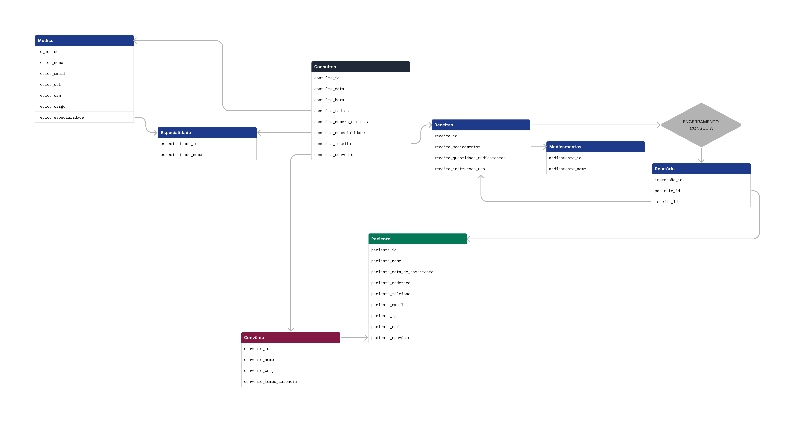
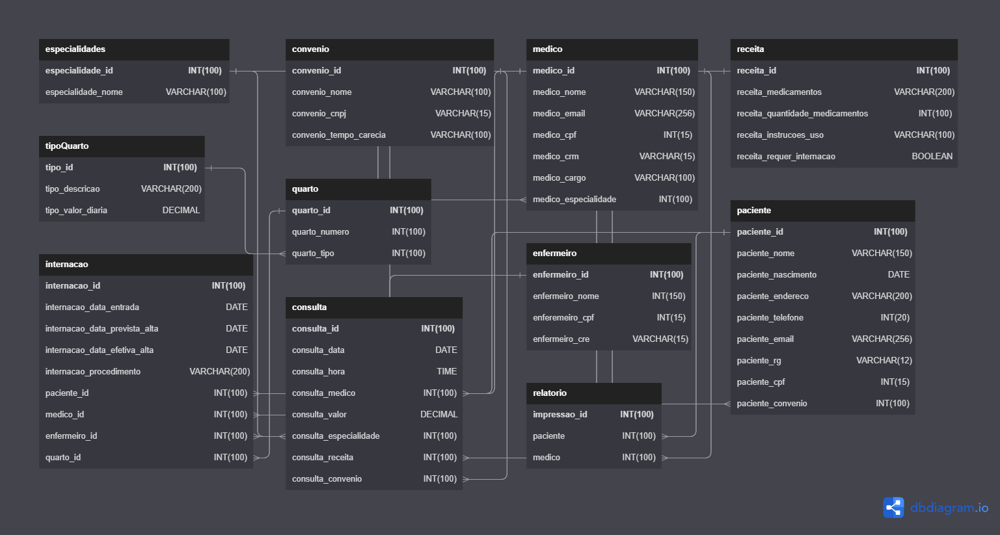

# O Hospital Fundamental

### Parte 1
Analise a seguinte descrição e extraia dela os requisitos para o banco de dados:
O hospital necessita de um sistema para sua área clínica que ajude a controlar consultas realizadas. Os médicos podem ser generalistas, especialistas ou residentes e têm seus dados pessoais cadastrados em planilhas digitais. Cada médico pode ter uma ou mais especialidades, que podem ser pediatria, clínica geral, gastroenterologia e dermatologia. Alguns registros antigos ainda estão em formulário de papel, mas será necessário incluir esses dados no novo sistema.

Os pacientes também precisam de cadastro, contendo dados pessoais (nome, data de nascimento, endereço, telefone e e-mail), documentos (CPF e RG) e convênio. Para cada convênio, são registrados nome, CNPJ e tempo de carência.

As consultas também têm sido registradas em planilhas, com data e hora de realização, médico responsável, paciente, valor da consulta ou nome do convênio, com o número da carteira. Também é necessário indicar na consulta qual a especialidade buscada pelo paciente.

Deseja-se ainda informatizar a receita do médico, de maneira que, no encerramento da consulta, ele possa registrar os medicamentos receitados, a quantidade e as instruções de uso. A partir disso, espera-se que o sistema imprima um relatório da receita ao paciente ou permita sua visualização via internet.



### Parte 2
No hospital, as internações têm sido registradas por meio de formulários eletrônicos que gravam os dados em arquivos. 

Para cada internação, são anotadas a data de entrada, a data prevista de alta e a data efetiva de alta, além da descrição textual dos procedimentos a serem realizados. 

As internações precisam ser vinculadas a quartos, com a numeração e o tipo. 

Cada tipo de quarto tem sua descrição e o seu valor diário (a princípio, o hospital trabalha com apartamentos, quartos duplos e enfermaria).

Também é necessário controlar quais profissionais de enfermaria estarão responsáveis por acompanhar o paciente durante sua internação. Para cada enfermeiro(a), é necessário nome, CPF e registro no conselho de enfermagem (CRE).

A internação, obviamente, é vinculada a um paciente – que pode se internar mais de uma vez no hospital – e a um único médico responsável.

Por último, crie um script SQL para a geração do banco de dados e para instruções de montagem de cada uma das entidades/tabelas presentes no diagrama completo (considerando as entidades do diagrama da atividade anterior e as novas entidades propostas no diagrama acima). Também crie tabelas para relacionamentos quando necessário. Aplique colunas e chaves primárias e estrangeiras.



### Parte 3 - Alimentando o banco de dados
Jogando nas regras que você criou: 
Crie scripts de povoamento das tabelas desenvolvidas na atividade anterior
Observe as seguintes atividades: 

- Inclua ao menos dez médicos de diferentes especialidades.
- Ao menos sete especialidades (considere a afirmação de que “entre as especialidades há pediatria, clínica geral, gastrenterologia e dermatologia”).
- Inclua ao menos 15 pacientes.
- Registre 20 consultas de diferentes pacientes e diferentes médicos (alguns pacientes realizam mais que uma consulta). As consultas devem ter ocorrido entre 01/01/2015 e 01/01/2022. Ao menos dez consultas devem ter receituário com dois ou mais medicamentos.
- Inclua ao menos quatro convênios médicos, associe ao menos cinco pacientes e cinco consultas.
- Criar entidade de relacionamento entre médico e especialidade. 
- Criar Entidade de Relacionamento entre internação e enfermeiro. 
- Arrumar a chave estrangeira do relacionamento entre convênio e médico.
- Criar entidade entre internação e enfermeiro.
- Colocar chaves estrangeira dentro da internação (Chaves Médico e Paciente).
- Registre ao menos sete internações. Pelo menos dois pacientes devem ter se internado mais de uma vez. Ao menos três quartos devem ser cadastrados. As internações devem ter ocorrido entre 01/01/2015 e 01/01/2022.
- Considerando que “a princípio o hospital trabalha com apartamentos, quartos duplos e enfermaria”, inclua ao menos esses três tipos com valores diferentes.
- Inclua dados de dez profissionais de enfermaria. Associe cada internação a ao menos dois enfermeiros.
- Os dados de tipo de quarto, convênio e especialidade são essenciais para a operação do sistema e, portanto, devem ser povoados assim que o sistema for instalado.

<details>
 <summary>Script</summary>

  ```mysql
  
  -- Adicionando covnenios
INSERT INTO convenio (convenio_nome, convenio_cnpj, convenio_tempo_carencia) VALUES
("Amil", 26444382000103, "24 Horas"),
("SulAmerica", 61838312000100, "30 Dias"),
("Bradesco Saude", 92680457000177, "180 Dias"),
("Unimed", 5910960900013, "2 Anos");

-- Aidicionando Especialidades
INSERT INTO especialidades (especialidade_nome) VALUES
("Pediatria"), 
("Clínica Geral"), 
("Gastrenterologia"), 
("Dermatologia"), 
("Psiquiatria"), 
("Ortopedia"), 
("Endocrinologia"), 
("Neurologia"), 
("Oncologia"), 
("Oftalmologia");

-- Adicionando médicos
INSERT INTO medico (medico_nome, medico_email, medico_cpf, medico_crm, medico_cargo, medico_especialidade) VALUES
("João Silva", "joao.silva@gmail.com", "111.222.333-44", "CRM-SP 12345", "Médico", 1),
("Pedro Santos", "pedro.santos@gmail.com", "111.222.333-45", "CRM-SP 23456", "Médico", 2),
("Maria Oliveira", "maria.oliveira@gmail.com", "111.222.333-46", "CRM-SP 34567", "Médico", 3),
("Roberto Costa", "roberto.costa@gmail.com", "111.222.333-47", "CRM-SP 45678", "Médico", 4),
("Amanda Ferreira", "amanda.ferreira@gmail.com", "111.222.333-48", "CRM-SP 56789", "Médico", 5),
("Lucas Souza", "lucas.souza@gmail.com", "111.222.333-49", "CRM-SP 67890", "Médico", 6),
("Carla Santos", "carla.santos@gmail.com", "111.222.333-50", "CRM-SP 78901", "Médico", 7),
("Julia Lima", "julia.lima@gmail.com", "111.222.333-51", "CRM-SP 89012", "Médico", 8),
("Rodrigo Almeida", "rodrigo.almeida@gmail.com", "111.222.333-52", "CRM-SP 90123", "Médico", 9),
("Luana Santos", "luana.santos@gmail.com", "111.222.333-53", "CRM-SP 01234", "Médico", 10);

-- Adicionando pacientes
INSERT INTO paciente (paciente_nome, paciente_nascimento, paciente_endereco, paciente_telefone, paciente_email, paciente_rg, paciente_cpf, paciente_convenio) VALUES
("Luísa Alves", "15-05-1982", "Rua José",11999998888, "luisa.alves@email.com", 55667788, 12345678900, 1),
("Pedro Henrique", "10-02-1975", "Avenida Brasil", 11987654321, "pedro.henrique@email.com", 11223344, 98765432111, 2),
("Ana Carolina", "20-07-1990", "Rua João Pessoa", 11333333333, "ana.caronlina@email.com", 44556677, 23456789022, 3),
("Lucas Mendes", "05-11-1988", "Rua General Glicério", 11777777777, "lucas.mendes@email.com", 88776655, 34567890133, 4),
("Mariana Ferreira", "02-09-1995", "Avenida Paulista", 1177778888, "mariana.ferreira@email.com", 77889900, 45678901244, 1),
("Guilherme Souza", "18-04-1980", "Rua do Rosário", 1155554444, "guilherme.souza@email.com", 33445566, 56789012355, 2),
("Fernanda Costa", "30-12-1985", "Avenida Rio Branco", 1166665555, "fernanda.costa@email.com", 22113344, 67890123466, 3),
("Bruno Santos", "25-06-1992", "Rua XV de Novembro", 1122221111, "bruno.santos@email.com", 55443322, 78901234577, 4),
("Marina Costa", "17-09-1987", "Rua Barão", 1133332222, "marina.costa@email.com", 88997766, 89012345688, 1),
("André Luiz", "01-02-1981", "Rua da Consolação", 1133334444, "andre.luiz@email.com", 11001122, 90123456799, 2),
("Camila Pereira", "19-06-1998", "Rua das Flores", 1144443333, "camila.pereira@email.com", 77665544, 1234567810, 3),
("Eduardo Santos", "07-03-1977", "Avenida Atlântica", 1122223333, "eduardo.santos@email.com", 66554433, 12345678901, 4),
("Juliana Ferreira", "13-12-1993", "Rua Major", 1144445555, "juliana.ferreira@email.com", 99887766, 234567890, 1),
("Rafaela Oliveira", "09-07-1991", "Rua Joaquim", 11977776666, "rafaela.oliveira@email.com", 99887766, 34567890123, 2),
("Gustavo Silva", "03-05-1986", "Avenida Rebouças", 1122223333, "gustavo.silva@email.com", 77665544, 45678901234, 3);

-- Inserindo Receitas
INSERT INTO receita (receita_medicamentos, receita_quantidade_medicamentos, receita_instrucoes_uso) VALUES
("Paracetamol", "500mg",  "1 comprimido de 6 em 6 horas durante 3 dias"),
("Dipirona", "500mg", "1 comprimido de 8 em 8 horas durante 2 dias"),
("Ibuprofeno", "400mg", "1 comprimido de 12 em 12 horas durante 5 dias"),
("Amoxicilina", "500mg", "1 comprimido de 8 em 8 horas durante 7 dias"),
("Omeprazol", "20mg", "1 comprimido de 12 em 12 horas durante 14 dias"),
("Diclofenaco", "50mg", "1 comprimido de 8 em 8 horas durante 3 dias"),
("Azitromicina", "500mg", "1 comprimido ao dia durante 5 dias"),
("Rivotril",  "2mg", "1 comprimido à noite antes de dormir"),
("Paroxetina ", "20mg", "1 comprimido de manhã após o café"),
("Sinvastatina",  "20mg", "1 comprimido à noite antes de dormir"),
("Losartana",  "50mg", "1 comprimido ao dia"),
("Captopril",  "25mg", "1 comprimido de 12 em 12 horas durante 7 dias"),
("Atenolol 25mg",  "1 comprimido ao dia"),
("Hidroclorotiazida", "25mg",  "1 comprimido ao dia"),
("Metformina", "500mg",  "1 comprimido de manhã e 1 comprimido à noite após as refeições"),
("Insulina", "Regular",  "aplicar 10 unidades antes das refeições"),
("Insulina", "NPH",  "aplicar 10 unidades à noite antes de dormir"),
("Levotiroxina","50mcg", "1 comprimido de manhã em jejum"),
("Clonazepam", "2mg", "1 comprimido antes de dormir"),
("Dexametasona", "4mg", "1 comprimido de manhã após o café durante 5 dias");

-- Inserindo Consultas
INSERT INTO consulta (consulta_data, consulta_hora, consulta_medico, consulta_valor, consulta_especialidade, consulta_receita, consulta_convenio, consulta_paciente) VALUES
    ('01-01-2015', '10:00:00', 1, 150, 1, 1, 1, 1),
    ('01-02-2015', '11:00:00', 2, 150, 2, 2, 2, 2),
    ('01-03-2015', '12:00:00', 3, 200, 3, 3, 3, 3),
    ('01-03-2015', '13:00:00', 4, 200, 4, 4, 4, 4),
    ('01-05-2015', '14:00:00', 5, 250, 5, 5, 1, 5),
    ('01-06-2015', '15:00:00', 6, 250, 6, 6, 2, 6),
    ('01-08-2015', '16:00:00', 7, 300, 7,7, 3, 7),
    ('01-08-2015', '17:00:00', 8, 300, 8, 8, 4, 8),
    ('01-09-2015', '18:00:00', 9, 350, 9, 9, 1, 9),
    ('01-10-2015', '19:00:00', 10, 350, 10, 10, 2, 10),
    ('01-01-2016', '10:00:00', 1, 150, 1, 11, 3, 11),
    ('01-02-2016', '11:00:00', 2, 150, 2, 12, 4, 12),
    ('01-03-2016', '12:00:00', 3, 200, 3, 13, 1, 13),
    ('01-03-2016', '13:00:00', 4, 200, 4, 14, 2, 14),
    ('01-05-2016', '14:00:00', 5, 250, 5, 15, 3, 15),
    ('01-06-2016', '15:00:00', 6, 250, 6, 16, 4, 1),
    ('01-08-2016', '16:00:00', 7, 300, 7, 17, 1, 2),
    ('08-01-2016', '17:00:00', 8, 300, 8, 18, 2, 3),
    ('01-09-2016', '18:00:00', 9, 350, 9, 19, 3, 4),
    ('01-10-2016', '19:00:00', 10, 350, 10, 20, 4, 5);

-- Inserindo Internações
INSERT INTO internacao (internacao_data_entrada, internacao_data_prevista_alta, internacao_data_efetiva_alta, internacao_procedimento, internacao_paciente_id, internacao_medico_id, internacao_enfermeiro_id, internacao_quarto_id) VALUES 
('2015-03-12', '2015-03-18', '2015-03-20', 'Cirurgia de emergência', 1, 3, 1, 1),
('2016-05-07', '2016-05-12', '2016-05-14', 'Cirurgia de emergência', 2, 4, 2, 2),
('2016-09-21', '2016-10-03', '2016-10-04', 'Cirurgia de emergência', 3, 1, 3, 3),
('2017-06-11', '2017-06-18', '2017-06-21', 'Cirurgia de emergência', 4, 2, 4, 2),
('2018-01-15', '2018-01-20', '2018-01-22', 'Cirurgia de emergência', 5, 3, 5, 1),
('2018-05-02', '2018-05-09', '2018-05-11', 'Cirurgia de emergência', 2, 4, 6, 3),
('2021-08-10', '2021-08-17', '2021-08-18', 'Cirurgia eletiva', 6, 1, 7, 2),
('2022-01-01', '2022-01-07', NULL, 'Cirurgia eletiva', 7, 2, 8, 3),
('2016-03-27', '2016-04-02', '2016-04-05', 'Cirurgia de emergência', 1, 5, 9, 1),
('2020-11-18', '2020-11-24', '2020-11-28', 'Cirurgia eletiva', 2, 6, 10, 2);

-- Inserindo quartos
INSERT INTO quarto (quarto_tipo, quarto_numero, quarto_andar, quarto_preco) VALUES 
('apartamento', 101, 1, 500.00),
('apartamento', 102, 1, 500.00),
('quarto duplo', 201, 2, 300.00),
('quarto duplo', 202, 2, 300.00),
('enfermaria', 301, 3, 150.00),
('enfermaria', 302, 3, 150.00),
('enfermaria', 303, 3, 150.00);

-- Inserindo enfermeiros
INSERT INTO enfermeiro (`enfermeiro_nome`, `enfermeiro_cpf`, `enfermeiro_cre`) VALUES 
    ('Carla Souza', '111.111.111-11', 'CRE-SP-123456'),
    ('Lucas Oliveira', '222.222.222-22', 'CRE-SP-654321'),
    ('Bruna Santo', '333.333.333-33', 'CRE-SP-987654'),
    ('Rafaela Costa', '444.444.444-44', 'CRE-SP-456789'),
    ('Paulo Ferreira', '555.555.555-55', 'CRE-SP-987654'),
    ('Camila Silva', '666.666.666-66', 'CRE-SP-789456'),
    ('Vinicius Almeida', '777.777.777-77', 'CRE-SP-321654'),
    ('Júlia Pereira', '888.888.888-88', 'CRE-SP-654987'),
    ('Tiago Rodrigues', '999.999.999-99', 'CRE-SP-159753'),
    ('Ana Lúcia Martins', '000.000.000-00', 'CRE-SP-753159');

-- Relacionando os enfermeiros com as internações
INSERT INTO enfermeiro_internacao (`enfermeiro_id`, `internacao_id`) VALUES 
    (1, 1),
    (2, 1),
    (3, 2),
    (4, 3),
    (5, 3),
    (6, 4),
    (7, 5),
    (8, 6),
    (9, 7),
    (10, 7),
    (2, 8),
    (3, 8),
    (4, 9),
    (5, 9),
    (6, 10),
    (7, 10);

-- Inserção de tipos de quartos
INSERT INTO tipoQuarto (tipo_quarto_descricao, tipo_quarto_valor) VALUES
('Apartamento', 500),
('Quarto Duplo', 300),
('Enfermaria', 150);
  
  ```
</details>

## Parte 4 - Alterando o banco de dados
Pensando no banco que já foi criado para o Projeto do Hospital, realize algumas alterações nas tabelas e nos dados usando comandos de atualização e exclusão:

- Crie um script que adicione uma coluna “em_atividade” para os médicos, indicando se ele ainda está atuando no hospital ou não. 
- Crie um script para atualizar ao menos dois médicos como inativos e os demais em atividade.

<details>
 <summary>Script</summary>
 
 ```mysql
 
 -- Configurando a coluna "em atividade" para os medicos
ALTER TABLE medico add em_atividade BOOLEAN;
UPDATE medico SET em_atividade = 1 where medico_id = 1;
UPDATE medico SET em_atividade = 1 where medico_id = 2;
UPDATE medico SET em_atividade = 0 where medico_id = 3;
UPDATE medico SET em_atividade = 1 where medico_id = 4;
UPDATE medico SET em_atividade = 1 where medico_id = 5;
UPDATE medico SET em_atividade = 0 where medico_id = 6;
UPDATE medico SET em_atividade = 1 where medico_id = 7;
UPDATE medico SET em_atividade = 1 where medico_id = 8;
UPDATE medico SET em_atividade = 1 where medico_id = 9;
UPDATE medico SET em_atividade = 1 where medico_id = 10;
 
 ```
</details>
